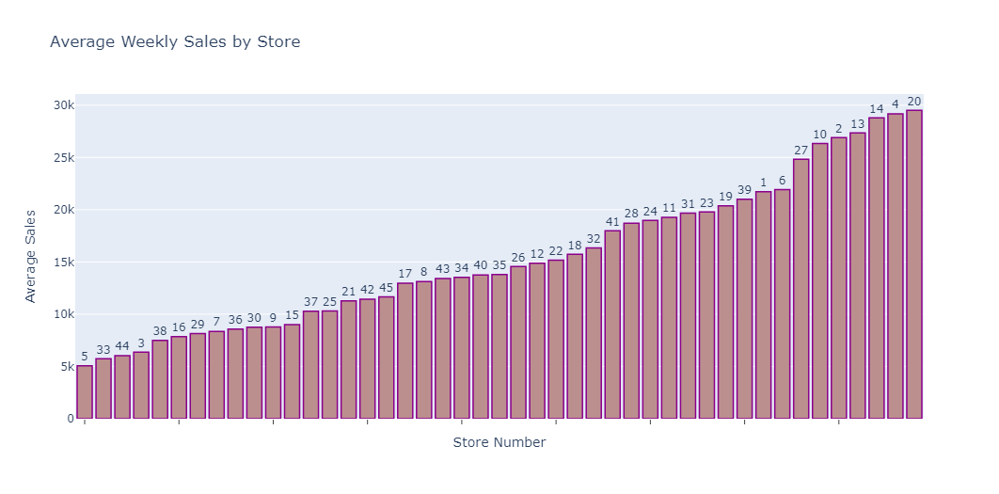
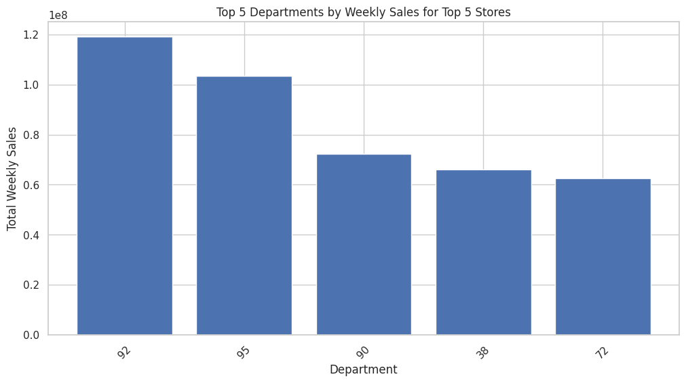
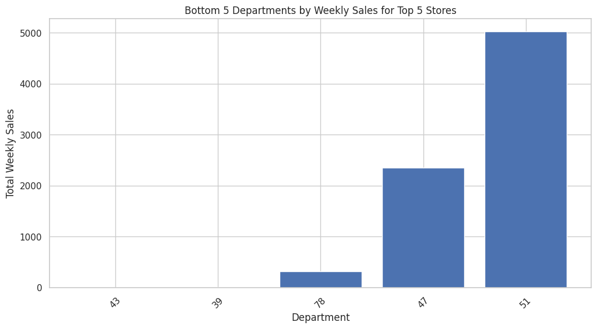
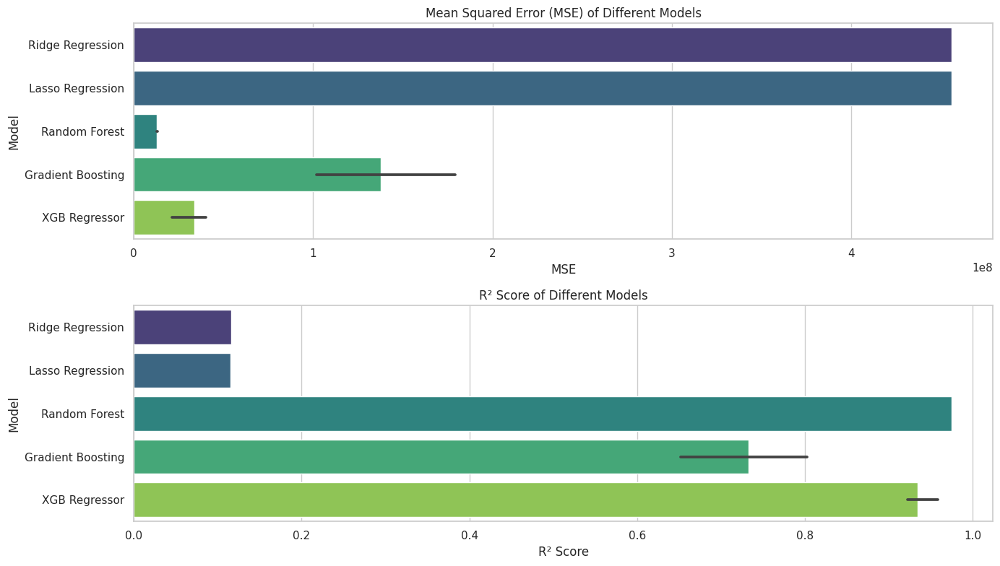
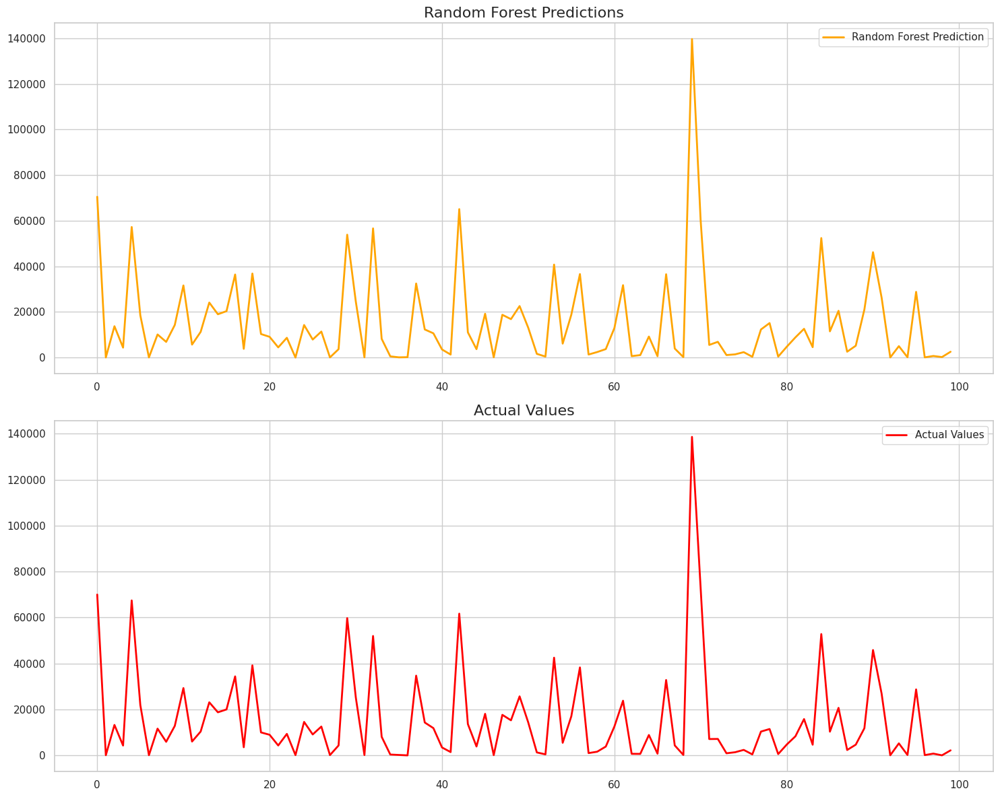
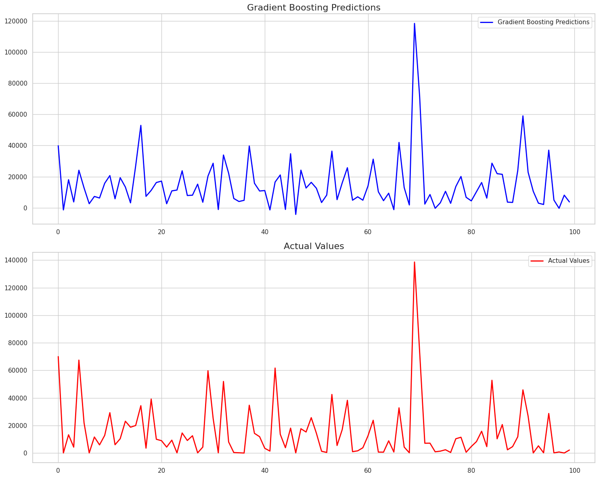
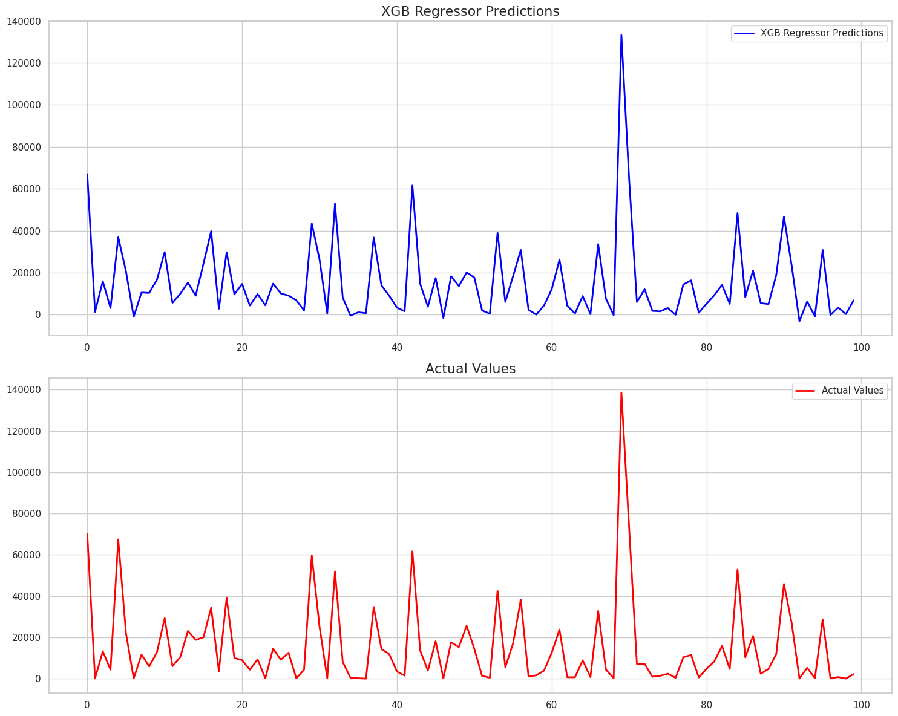
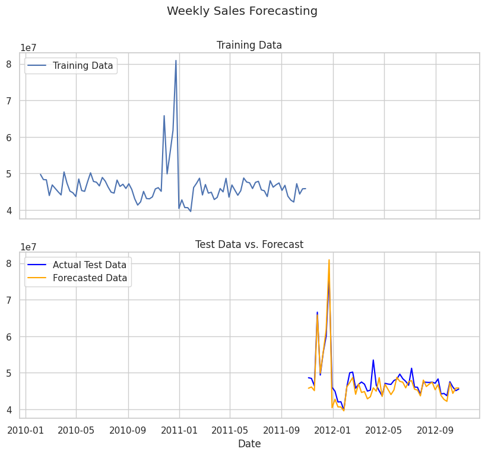
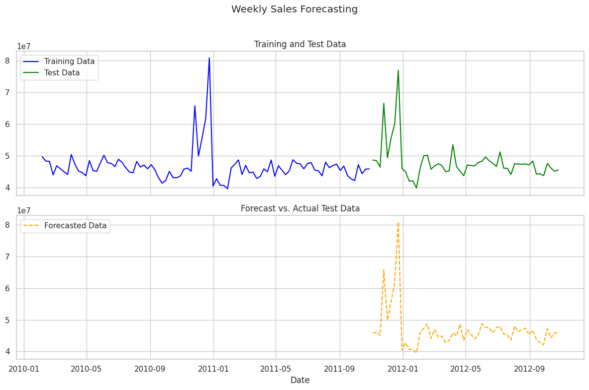

# Walmart Retail Sales Analysis and Forecasting

Badge [source](https://shields.io/)

## Authors

- [@sagarbapodara](https://github.com/SagarBapodara)

## Problem Statement
Sales forecasting is a crucial tool for retail organizations to develop strategies that align with demand and create promotions to enhance sales. Walmart, a billion-dollar American retail giant, operates over 10,000 stores worldwide and over 4,000 across the United States (ref: https://corporate.walmart.com/about/location-facts). Accurate sales forecasting allows the company to manage inventory, predict revenue, and make informed decisions regarding new investments. Achieving predetermined targets early in the season can positively influence stock prices and shape investors' perceptions. On the other hand, missing these projections could significantly harm stock prices, which would be particularly detrimental for a large company like Walmart.

## Aim
This project aims to develop a model that can forecast store sales based on past sales patterns. This model allows decision-makers to make critical business decisions, maximize revenue, and improve sales in underperforming departments.

## 

Link to my Kaggle Notebook here [🔗](https://www.kaggle.com/code/sagarbapodara/walmart-sales-eda-modelling-forecasting)

Link to Medium Article with explanations here [🔗](https://medium.com/@sagarbapodara/the-future-of-walmart-sales-in-depth-analysis-and-forecasting-806241dc3300)

## Dataset
The data has been taken from [Kaggle](https://www.kaggle.com/datasets/aslanahmedov/walmart-sales-forecast/data). All the data files including the merged data are placed in [data](https://github.com/SagarBapodara/Walmart-Sales-Forecasting/tree/main/data) folder. 

Dates in the dataset range from 2010-02-05	to 2013-05-17, which is ~ 3 years. 

It contains 4 files:
<pre>
  1. features.csv: Data related to the store, department, and regional activity for the given dates.
  2. train.csv: Historical training data, which covers data from 2010–02–05 to 2012-08-17.
  3. test.csv: Similar to train.csv, we've to predict weekly sales.
  4. stores.csv: Contains anonymized information about the 45 stores, indicating the type and size of the store.
</pre>

## Requirements

Required dependencies are placed here: [requirements.txt](https://github.com/SagarBapodara/Walmart-Sales-Forecasting/blob/main/requirements.txt). Install them using the following command: 
<pre>
  pip install -r /path/to/requirements.txt
</pre>

## EDA: 

1. Average Weekly Sales by Stores

2. Top 5 departments in top 5 stores by weekly sales

3. Bottom 5 departments in top 5 stores by weekly sales

## Inference
<pre>
Note: Some department numbers are missing
  
Top 5 Departments by weekly sales:
1. 92: Dry Grocery
2. 95: Grocery, Snacks, and Beverages
3. 90: Dairy
4. 38: Prescription Pharmacy
5. 72: Electronics

Bottom 5 Departments:
1. 43: Toys
2. 39: Misc/Jewellery
3. 78: Ladieswear (Part of Fashion)
4. 47: Part of Fashion
5. 51: Sporting Goods

</pre>

## Results: 

| Model               | MSE          | R² Score  |
|---------------------|--------------|-----------|
| Ridge Regression     | 4.559058e+08 | 0.115813  |
| Lasso Regression     | 4.561385e+08 | 0.115362  |
| Random Forest (n = 50)       | 1.306101e+07 | 0.974669  |
| Random Forest (n = 50, md=100)       | 1.306101e+07 | 0.974669  |
| Random Forest (n = 100)     | 1.274589e+07 | 0.975281  |
| Random Forest (n = 100, md=100)       | 1.274589e+07 | 0.975281  |
| Gradient Boosting (n = 50)    | 1.793905e+08 | 0.652089  |
| Gradient Boosting (n = 100)    | 1.321454e+08 | 0.743716  |
| Gradient Boosting (n = 200)   | 1.017133e+08 | 0.802736  |
| XGB Regressor (n = 50)       | 4.020566e+07 | 0.922025  |
| XGB Regressor (n = 100)       | 4.020566e+07 | 0.922025  |
| XGB Regressor (n = 200)       | 2.124197e+07 | 0.958803  |

## Combined Results (MSE, R^2)

## Actual Model Output v/s Test data: 

1. Random Forest Regressor

2. Gradient Boosting

3. XGB Regressor

## Forecasting: 

SARIMA metrics: 
<pre>
  Mean Absolute Error (MAE): 1597388.9843533235
  Root Mean Squared Error (RMSE): 2128341.295087557
  Mean Absolute Percentage Error (MAPE): 10.139488649093506%
  Accuracy: 89.86051135090649%
</pre>

## Dashboard

A [PowerBI](https://app.powerbi.com/) dashboard using a smaller subset of US retail sales data has also been developed:  

The data file (in CSV format) is placed in [data folder.](https://github.com/SagarBapodara/Walmart-Sales-Forecasting/tree/main/dashboard/data)

## 🚀 Thanks

Thanks for looking into the project and being here. Feel free to share your reviews/suggestions/remarks! :)

**If you found it useful, leave a ⭐ here!**

## License

[MIT](https://choosealicense.com/licenses/mit/)
